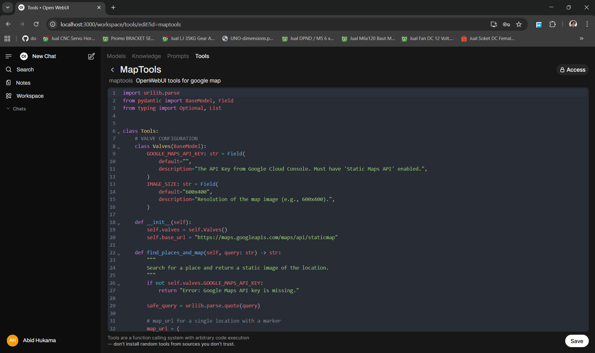
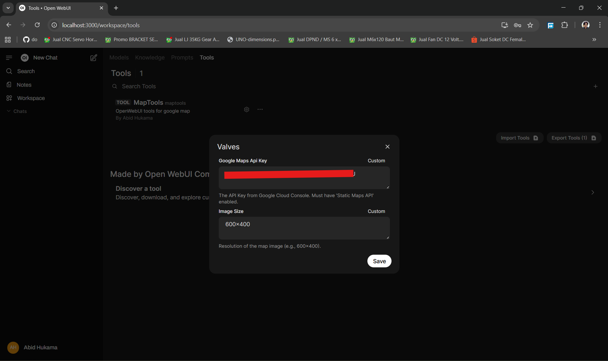
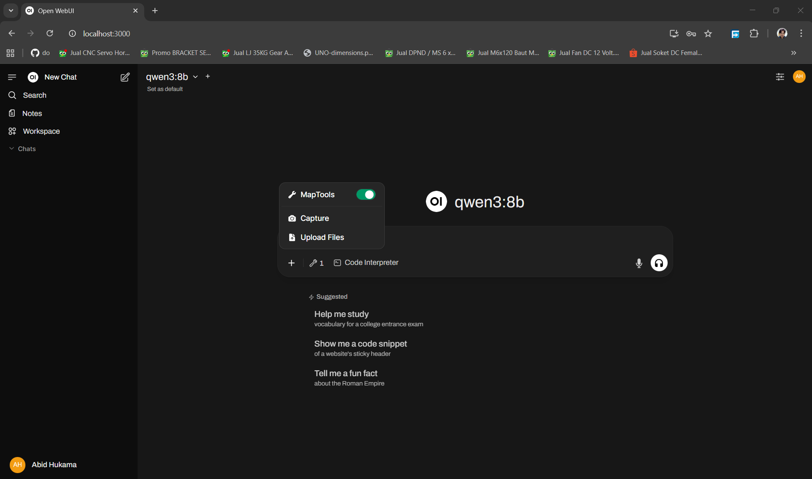
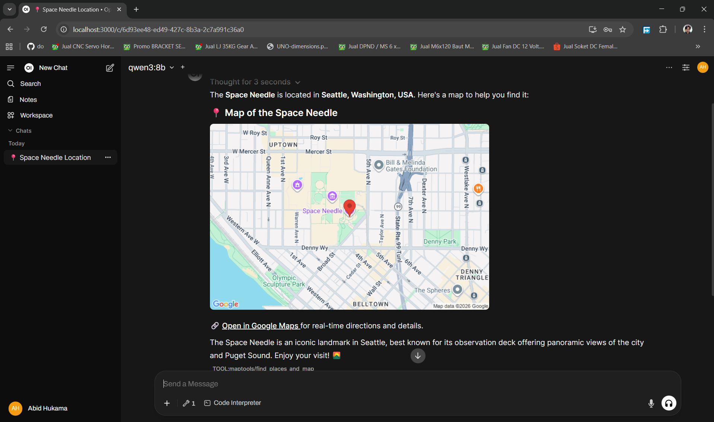
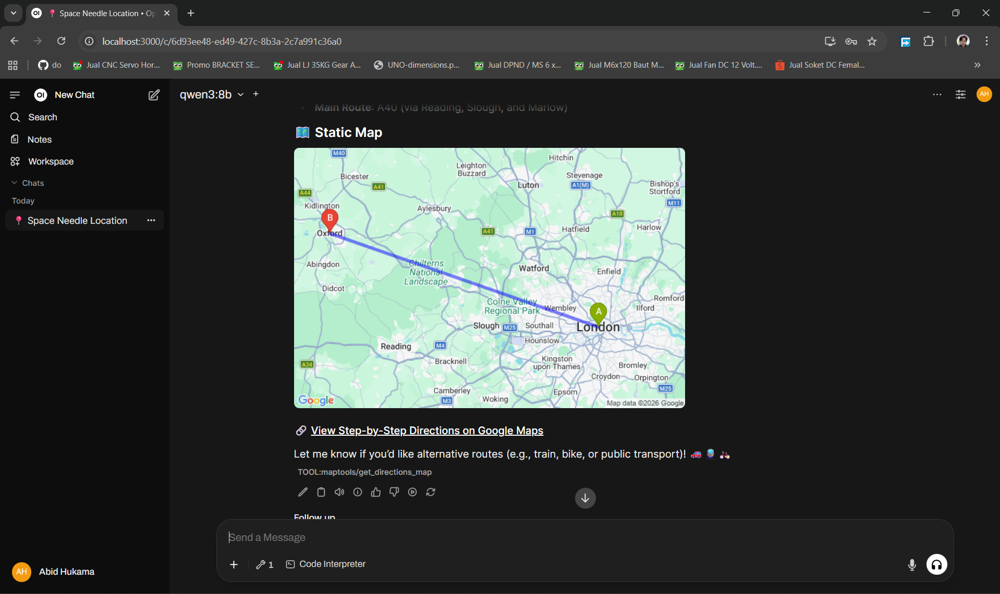

## 📖 Executive Summary

The goal of this project was to extend the capabilities of a local Large Language Model (LLM) to include geospatial awareness. By leveraging the **Open WebUI Tools API** and **Google Maps API**, the LLM can now interpret location based queries and return embedded maps and navigation routes directly in the chat interface.

## 🛠️ Technical Architecture

The system follows a modular "Tool" architecture within Open WebUI.

  - > **Frontend/Interface:** Open WebUI.

  - > **Intelligence:** Local LLM (e.g., Llama 3, qwen3).

  - > **Backend Logic:** Python-based Tool Open WebUI.

  - > **Geospatial Provider:** Google Maps Static API.

## ⚙️ Installation & Setup

### 1\. Google Cloud Configuration

To ensure usage limits and security, follow these steps:

1.  > Log in to the [Google Cloud Console](https://www.google.com/search?q=https://console.cloud.google.com/).

2.  > Create a new project (to utilize the $200 monthly free credit).

3.  > **Enable APIs:** Search for and enable the **Maps Static API**.

4.  > **Credentials:** Create an **API Key**.
    
      - > *Security Best Practice:* Under "API Restrictions," restrict this key to only the "Maps Static API" to prevent unauthorized usage of other services.

### 2\. WebUI Installation 

1.  > Run the following command on WSL 2 or Ubuntu:

> *docker run -d -p 3000:8080 --gpus=all -v ollama:/root/.ollama -v open-webui:/app/backend/data --name open-webui --restart always ghcr.io/open-webui/open-webui:ollama*

2.  > Alternatively, switch to a specific version:

> *ghcr.io/open-webui/open-webui:v0.8.0*
> 
> *ghcr.io/open-webui/open-webui:v0.8.0-ollama*
> 
> *ghcr.io/open-webui/open-webui:v0.8.0-cuda*

### 3\. Open WebUI Implementation

3.  > Open your **Open WebUI** dashboard.

4.  > Navigate to **Workspace** \> **Tools** \> **Create a New Tool**.

5.  > **Paste the Code:** Copy the provided Python script into the editor.

> 

6.  > **Configuration (Valves):**
    
      - > Save the tool.
    
      - > Click on the **Settings/Gear icon** for the tool.
    
      - > Enter your Maps\_API\_KEY in the Valve configuration field.

5\. **Make sure enable Maps Tools Before Chat:**

## 🚀 How It Works

The implementation utilizes a class-based structure that Open WebUI interprets as callable functions for the LLM.

### Logic Flow:

1.  > **Intent Recognition:** When a user asks "Where is the Eiffel Tower?" the LLM recognizes it needs a map and triggers the find\_places\_and\_map function.

2.  > **Input Sanitization:** The tool uses urllib.parse.quote(query) to ensure the user's string is safe for URL transmission.

3.  > **Dynamic URL Generation:** The script constructs a request to Google’s Static Maps API, embedding markers and paths.

4.  > **Markdown Rendering:** The tool returns a Markdown string containing:
    
      - > A header with the location name.
    
      - > An embedded image (the static map).
    
      - > A deep link to the full Google Maps site for navigation.

## 💡 Usage Examples

### Single Location Search

**User:** "Can you show me where the Space Needle is?"

**LLM Output:**

> 

### Route & Directions

**User:** "Show me the way from London to Oxford."

**LLM Output:**

> 

## 🛡️ Security & Constraints

  - > **Access Security:** The use of "Valves" ensures that the API key is stored as an environment-level configuration rather than being hardcoded, protecting it from being leaked in the prompt context.

  - > **Usage Limits:** The Static Maps API is cost-effective; however, it is recommended to set billing alerts in the Google Cloud Console to monitor the free credit usage.

  - > **Assumptions:** It is assumed the user has an active internet connection to fetch the map images, even if the LLM is running locally.

## 🛠️ Code Maintenance & Best Practices

The current implementation uses urllib.parse which is part of the Python standard library, minimizing external dependencies and ensuring a lightweight footprint. For future iterations, consider:

  - > **Dynamic Zoom:** Allowing the LLM to adjust the zoom level based on the size of the city/area.

  - > **Cache:** Implementing a local cache for frequently requested maps to reduce API calls.

  - > **Embedded HTML**: We recommend using an embedded HTML Google Map instead of a static Google Map image. However, Open WebUI currently does not directly support embedded HTML, so a static image is used for this project.

  - > **Pipelines**: For larger or more complex projects, we recommend using a pipelines approach instead of tools within Open WebUI.
